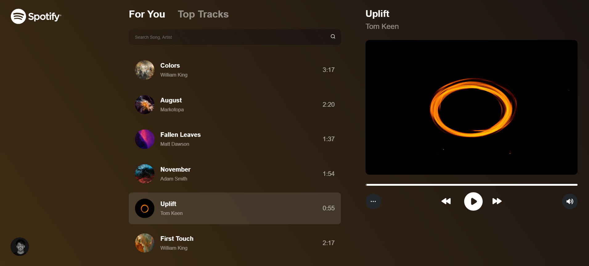
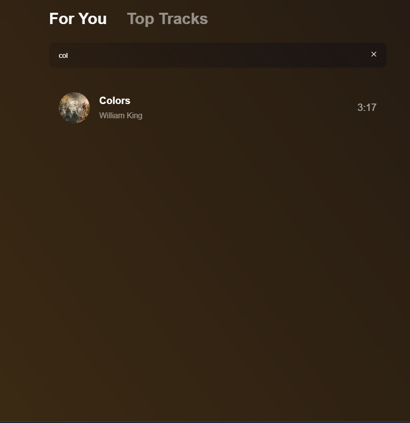
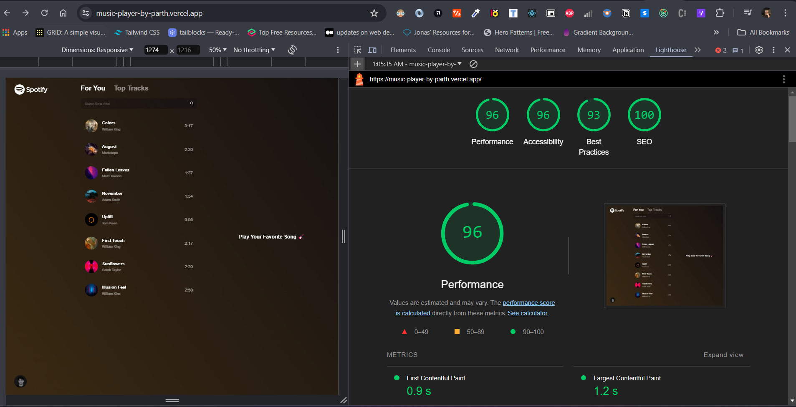

# Mucic Player
### A music player made using ReactJS and a custom API.
<br>

- [Deployed Link](https://music-player-by-parth.vercel.app/)

## Contributors

- [Partha](https://www.github.com/partha7978)
<br><br>

## Features
 - Search Music
 - Control music via Seeker
 - Play, pause, next and previous
 - Tab switch from all to top tracks
 - Implemented throttle in search
 - Implemented responsive design across all devices upto 320px

## Screenshots

| Home Page | Search Result | Small Screen |
| :---: | :---: | :---: |
|  |  |  |


## Lighthouse Score and Accessibility 

| Lighthouse Score | ADA issue | 
| :---: | :---: |
|  |  |


## Installation

Install music player on your local machine

```bash
  git clone https://github.com/partha7978/music-player

  cd music-player
```

### After installing on your local machine, you have to install all the packages that are used in this project.

```bash
  npm install
``` 

### To run this project on your local machine

```bash
  npm run dev
```

## Tech Stack

* React
* Redux Toolkit
* React Icons


### Contributions are welcome. Please open an issue or a pull request on  [GitHub](https://github.com/partha7978/music-player)

<br> 

### Copyright (c) 2022 <a href="https://parthasarathimuduli.vercel.app/" target="_self">Partha Sarathi Muduli</a>